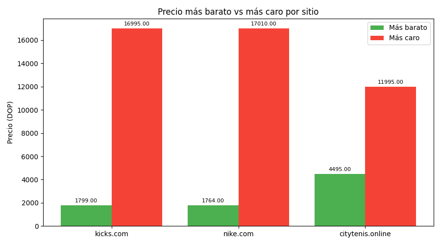
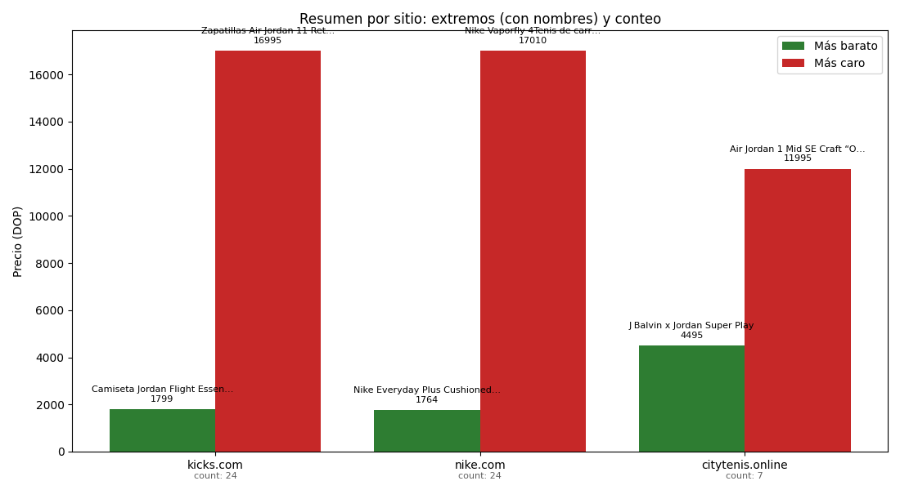
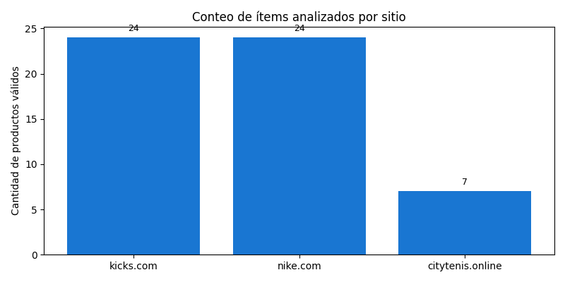

# Web-scraping — Price Comparison (simple)

Proyecto de ejemplo para extraer listas de precios de 3 páginas y comparar promedios / extremos.

## Estructura clave
- src/app/service/consultHTTP.py — funciones que consultan cada página (selectores estáticos).
- src/app/controller/pipeline.py — orquesta consultas y genera resumen/gráfica.
- src/lib/requirements.txt — dependencias Python.
- src/logs/html/ — HTML de debug y gráficos generados.
- env — archivo con las URLs (PAGE1_URL, PAGE2_URL, PAGE3_URL).

## Requisitos (Windows)
- Python 3.10+ recomendado.
- Virtualenv opcional.

## Script de Arranque

- Ejecutando desde la carpeta raiz el `startup.bat` estaria instalando las dependencias y ejecutando el proyecto

## Instalación (opciones)

`pip install -r src/lib/requirements.txt`


```

2) Ejecutar el script de arranque
- Ejecutar `startup.bat` en la raíz del proyecto.

## Cómo ejecutar
Desde la raíz del proyecto:

- Ejecutar el pipeline directamente:
```powershell
python .\src\app\main.py
# o, si estás dentro del directorio src:
python .\app\main.py
```

- Ejecutar pruebas unitarias:
```powershell
aun en proceso
```

## Qué hace el pipeline
- Llama a consult_page1 / consult_page2 / consult_page3.
- Normaliza y parsea precios (maneja formatos con comas/puntos y etiquetas como RD$ / $).
- Convierte precios de USD → DOP multiplicando por la tasa (por defecto 63).
- Calcula promedio por página, encuentra producto más barato (no 0) y más caro.
- Muestra la gráfica de promedios con matplotlib (ventana interactiva si hay backend GUI). Si el entorno es headless, guarda `avg_prices.png` en `src/logs/html/`.

## Notas importantes
- Selectores (etiquetas/clases CSS usados en consultHTTP.py) son estáticos y pueden romperse si la web cambia: ajustarlos según el HTML real.
- Las URLs de las páginas están definidas en el archivo `env` del proyecto; modifica ahí si cambias páginas.


## Logs y debug
- HTML guardado: `src/logs/html/debug_page1_raw.html`, `debug_page1_playwright.html`, etc.
- Log principal: `src/app/logs/cliente_http.log` (revisa si hay errores TLS o parser faltante).

## Fotos

- `extremes.png`: Gráfico comparativo que muestra el precio más barato y el más caro por cada sitio.

  

- `extremes_summary.png`: Gráfico detallado con nombres abreviados de los productos más barato y más caro por sitio, incluyendo el conteo total de productos.

   

- `counts.png` Gráfico que indica la cantidad de productos analizados en cada sitio.
  
  

- Las fotos se guardan en `src\logs\html` como `counts.png`, `extremes_summary.png`, `extremes.png`
